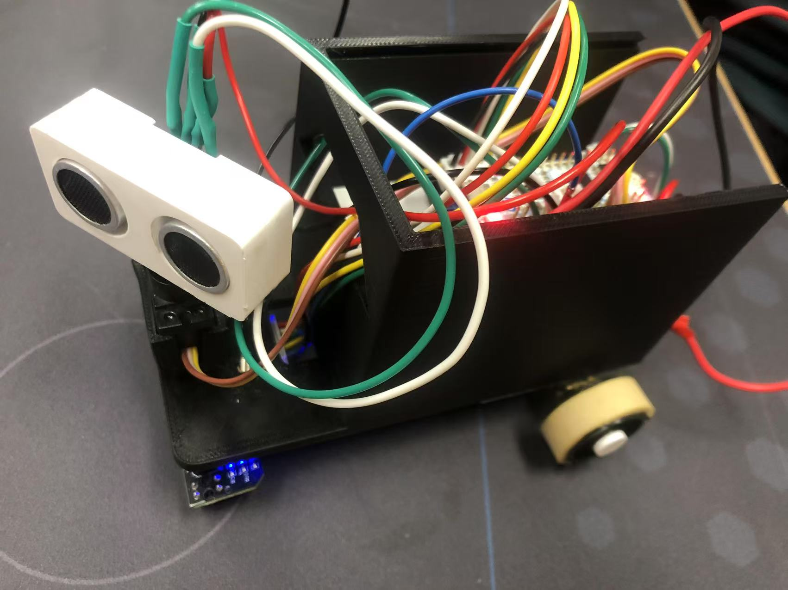
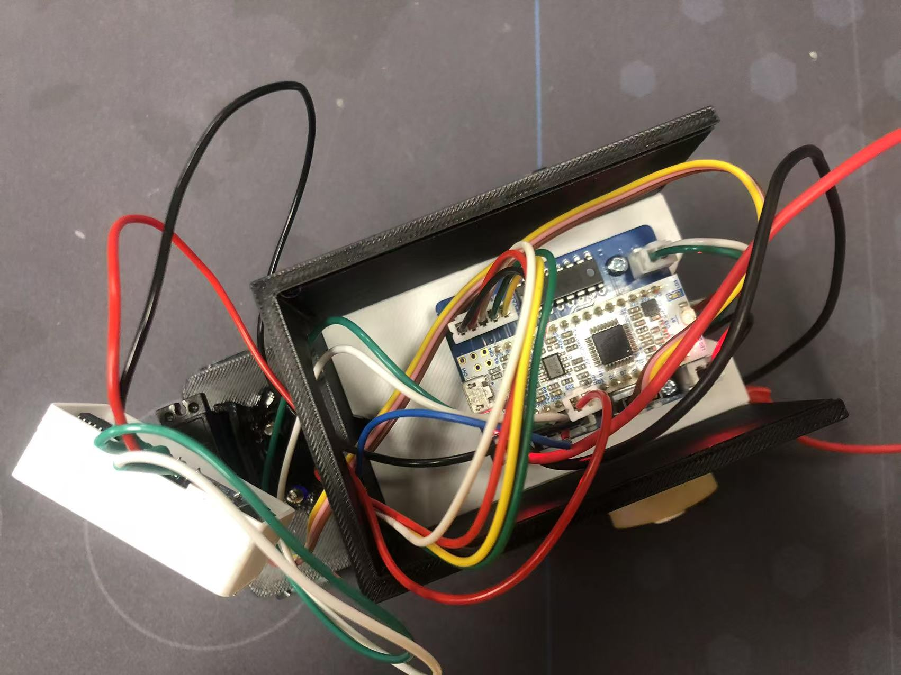
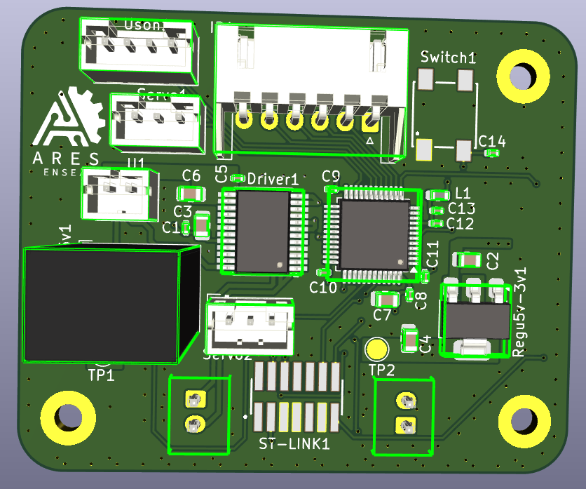
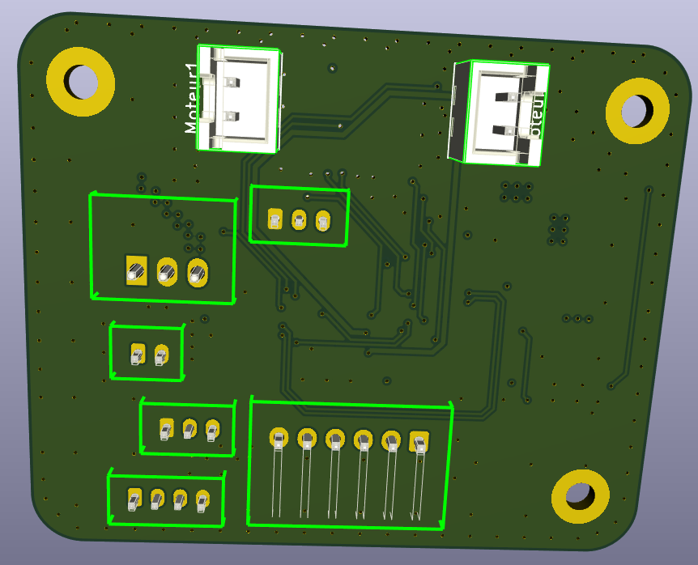

# Projet PAMI - Coupe de France des 1A

Ce projet consiste en la conception et la construction des robots **PAMI** pour la Coupe de France de Robotique.

## Description du robot actuel

Le robot actuel est équipé des éléments suivants :  
- Un **module suiveur de ligne** avec **4 capteurs/récepteurs infrarouges**.  
- Un **servomoteur** utilisé pour l'algorithme d'évitement d'obstacles.  
- Un **module ultrason** pour l'estimation des distances et la détection d'obstacles.  
- Une carte **Nucleo** pour la commande et la gestion des données.  
- Un **shield** (de dimensions 4,5 cm x 6,5 cm) permettant de connecter les composants entre eux.  
- Des piles rechargeables **Ni-MH 7,2V 2Ah** pour l'alimentation.  
- Deux **moteurs DC à engrenages métalliques** assurant la propulsion.  

### Images du robot actuel

  
  

---

## Nouvelle version en cours de développement

Nous avons commencé la conception de la prochaine version du robot **PAMI**, qui sera équipée des améliorations suivantes :  
- Un **PCB 4 couches** (de dimensions 4,5 cm x 5,5 cm), conçu pour intégrer directement le contrôle de tous les composants du robot.  
- Deux **servomoteurs** :
  - L’un dédié à l’algorithme d’évitement des obstacles.  
  - L’autre utilisé comme actionneur pour diverses fonctionnalités.  

### Images du PCB :

---

