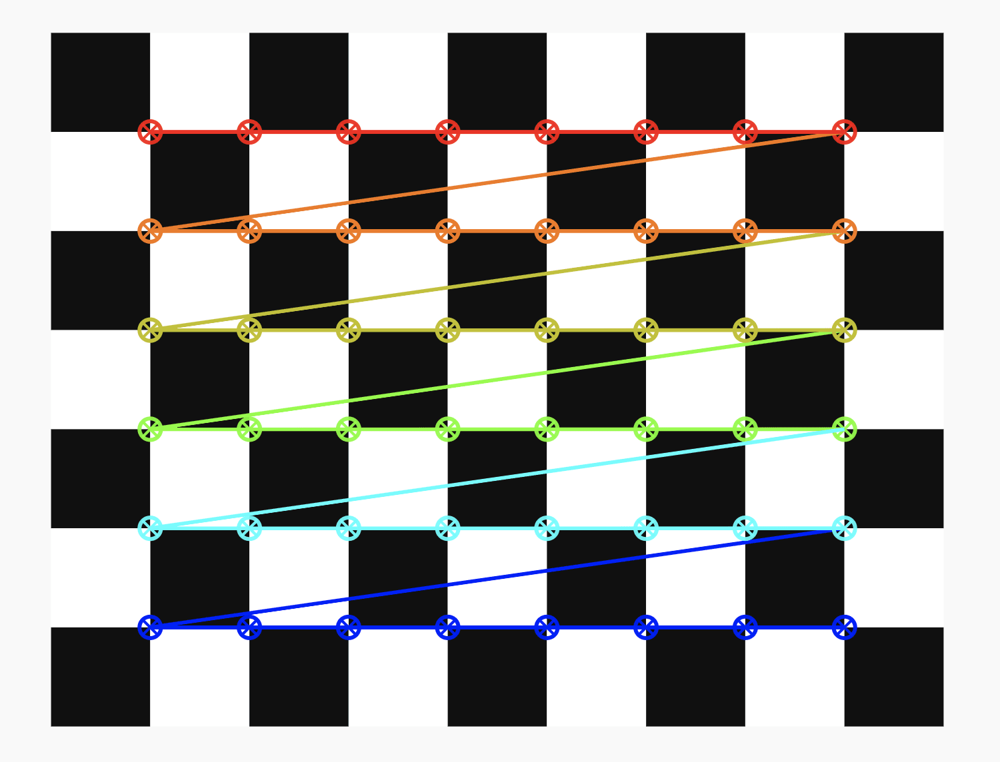
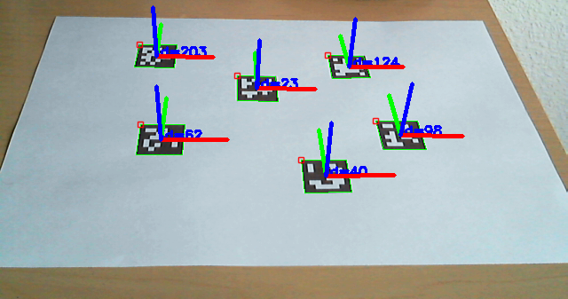

# 🎯 Vision – Projet 2A ARES CFR (Coupe de France de Robotique)

Ce dépôt regroupe les travaux de l'équipe **Vision** pour le projet **2A ARES CFR**, dans le cadre de la **Coupe de France de Robotique**.

---

## 🧠 Objectifs du Système de Vision

Développer un système capable de :
1. **Détecter des éléments et marqueurs (ArUco)** dans un environnement robotique.
2. **Fournir une position précise** du robot en temps réel.
3. **Calculer des chemins optimaux**, en intégrant les contraintes dynamiques du terrain.

---

## 🔧 1. Calibration de la Caméra

### 🔍 Contexte
Calibration indispensable pour corriger les **distorsions optiques** et garantir la **précision** des mesures.

### 🧪 Méthodologie
- Utilisation d’un échiquier et de **ROS + OpenCV**.
- Détection des coins → calcul des matrices intrinsèques/extrinsèques.
- Validation avec modèle de reprojection.

### ✅ Résultats
- **50 images** utilisées, faible erreur RMS.
- Matrice intrinsèque + coefficients de distorsion.
- Tests validés sur maquette et en conditions réelles.

*Fig. 1 : Image utilisée pour la calibration.*

---

## 🧭 2. Détection des Marqueurs ArUco

### 📜 Contexte
Le règlement impose des marqueurs ArUco fixes sur le terrain. Ils servent de **points de référence** pour localiser le robot.

### ⚙️ Méthodologie
- Détection avec **OpenCV**.
- Extraction des IDs + calcul des vecteurs (translation & rotation).
- Tests en environnement réel, robustesse validée (lumière, perturbations).

*Fig. 2 : Marqueurs fixes définis par le règlement.*

### 🧪 Résultats

#### ✅ Sur maquette :
- Détection précise des IDs et vecteurs.

*Fig. 3 : ArUco détectés sur la maquette.*

#### ✅ En conditions réelles :
- Bonne robustesse, même en présence d’ombres ou d’objets.

*Fig. 4 : Détection fiable dans un environnement encombré.*

---

## 🗺️ 3. Positionnement & Cheminement

### 🧭 Détermination de la position initiale
- Les ArUco servent de repères pour définir l’origine.
- Transformation vers une **représentation 2D** exploitable.
- Discrétisation du terrain pour identifier les zones accessibles.

*Fig. 5 : Position initiale représentée en 2D.*

### 🔄 Suivi du mouvement
- Mises à jour dynamiques selon les vecteurs.
- Ajustement en cours sur l’estimation de la distance parcourue.

*Fig. 6 : Mise à jour de la position du robot.*

---

## 🏗️ 4. Infrastructure : Tour Caméra

En attendant la structure finale de l’équipe mécanique, une **tour temporaire** a été fabriquée pour fixer la caméra.

*Fig. 7 : Structure provisoire pour la caméra.*

---

## 📈 5. Performances & Mesures

### 🎯 Objectif
Comparer la **position calculée** vs **position réelle** pour mesurer la précision du système.

### 📊 Résultats

- **Erreur moyenne** : ~ **1.8 cm**
- **Fréquence (FPS)** :
  - Setup normal : **3–4 FPS**
  - Setup optimisé : **10–12 FPS**

### 📉 Graphe de performance FPS (manquant dans version précédente)

*Fig. 8 : FPS du setup normal.*

---

## 🎥 6. Démonstration Vidéo

Une vidéo illustre le fonctionnement du système en temps réel, montrant la **réactivité** et la **précision** de la localisation :

➡️ [Lien vers la démonstration vidéo](https://github.com/user-attachments/assets/b6591760-27ca-40ef-97e6-4b8968a7495c)

---

## 🖼️ 7. Illustrations Complémentaires

**Détection des ArUco sur la maquette :**  

**Vue du terrain avec les ArUco visibles :**  

---

## ✅ 8. Conclusion & Roadmap

Le système est **fiable**, **réactif** et prêt pour une intégration complète dans le système de navigation.

### 🚀 Prochaines étapes :
- Améliorer l’estimation des distances.
- Générer une carte exploitable par **ROS** (niveaux de gris).
- Finaliser l'intégration ROS.
- Tests intensifs sur terrain réel.

---

### 👥 Équipe Vision
- **Khalid ZOUHAIR**
- **Mohamed EL KOURMISS**
- **Abderrahmane EL FELSOUFI**

---

