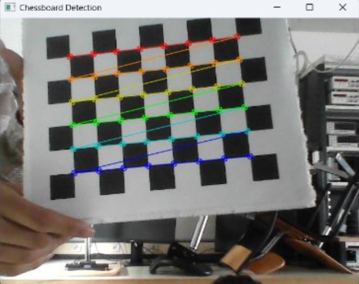
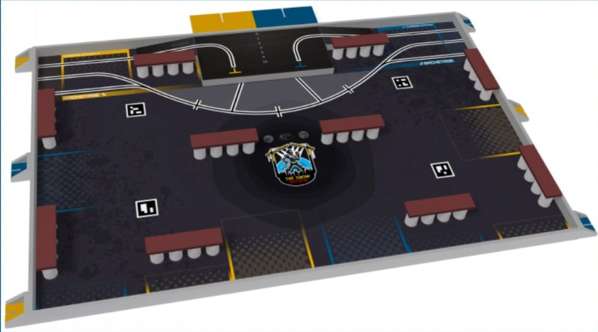
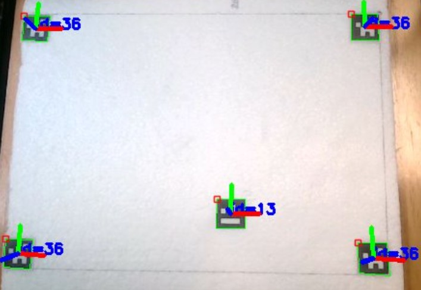
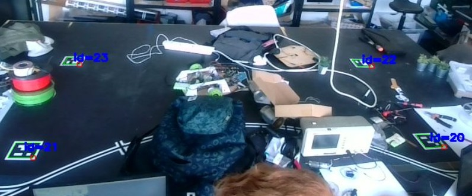
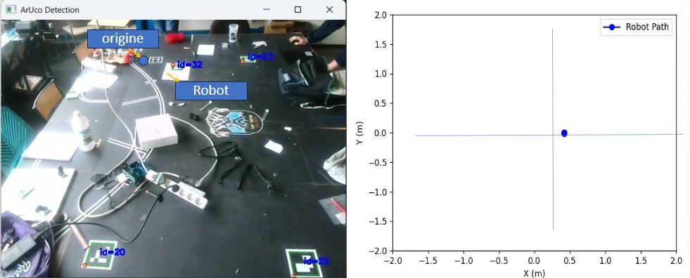
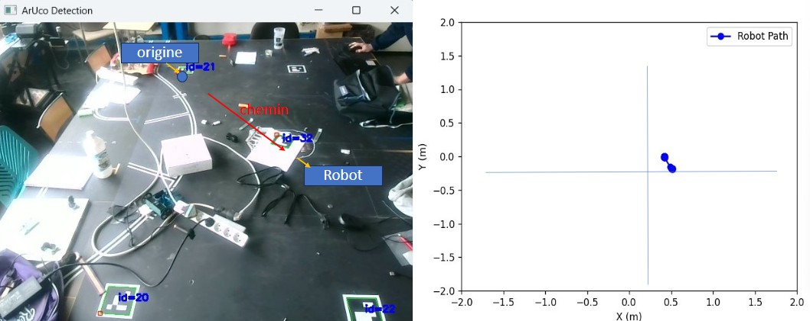
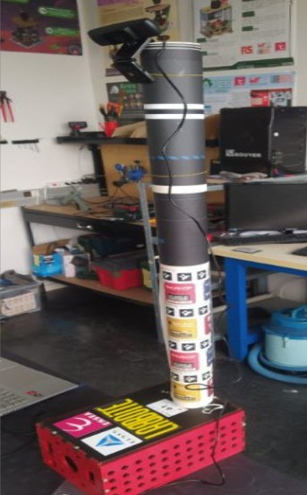

# Vision - Projet 2A Ares CFR

Ce dépôt contient les travaux de l'équipe Vision pour le projet 2A Ares CFR, dans le cadre de la Coupe de France de Robotique. 

L'objectif est de développer un système de vision performant permettant :
1. La reconnaissance d'éléments et marqueurs dans un environnement robotique.
2. Le calcul de chemins optimaux pour le robot en intégrant les contraintes dynamiques du terrain de jeu.

---

## **1. Calibration de la Caméra**

### **Contexte et Méthodologie**
La calibration de la caméra est une étape cruciale pour corriger les distorsions optiques et garantir la précision des mesures. 
Elle a été réalisée en utilisant un échiquier standard avec ROS et OpenCV. Les principales étapes suivies étaient :
- Capture de plusieurs images de l'échiquier à partir de différents angles.
- Détection automatique des coins de l'échiquier dans chaque image.
- Calcul des paramètres intrinsèques et extrinsèques à l'aide de la méthode de régression linéaire.
- Validation des résultats à l'aide d'un modèle de reprojection.

### **Résultat**
- Calibration validée sur 50 images d’un échiquier avec une faible erreur RMS.
- Les paramètres calculés incluent :
  - Une matrice intrinsèque précise pour la caméra.
  - Des coefficients de distorsion réduisant les aberrations.
- Tests validés sur la maquette et dans des conditions réelles.

**Illustration de la calibration avec un échiquier :**

*Fig. 1 : Image utilisée pour la calibration.*

---

## **2. Détection des ArUco**

### **Contexte et Règlement**
Le règlement de la compétition impose l’utilisation de marqueurs ArUco fixes sur le terrain de jeu. Ces marqueurs servent de points 
de référence pour le positionnement du robot. Nous avons conçu un pipeline complet pour exploiter ces ArUcos et fournir des données 
précises sur la localisation et l’orientation du robot.

### **Méthodologie**
- Détection des marqueurs grâce à la bibliothèque OpenCV.
- Extraction des IDs des ArUco et calcul des vecteurs de translation et de rotation.
- Validation des résultats par des tests comparatifs avec des données réelles.
- Robustesse testée dans différents environnements avec des niveaux d’éclairage variés.

**Illustration des ArUco fixes sur la table :**

*Fig. 2 : Exemple tiré du règlement, montrant les marqueurs ArUco fixes.*

### **Implémentation et Résultats**

#### **Détection des ArUco sur une maquette**
- Le système détecte les ArUco avec leurs orientations.
- Extraction précise des vecteurs de translation et de rotation pour chaque marqueur.

**Exemple de détection des ArUco :**

*Fig. 3 : Détection des ArUco sur une maquette avec retour des IDs et des vecteurs associés.*

#### **Détection en conditions réelles**
- Robustesse démontrée sur le terrain de jeu, malgré des perturbations visuelles (objets et ombres).
- Optimisation des paramètres de détection pour minimiser les erreurs.

*Fig. 4 : Détection robuste des ArUco dans un environnement encombré.*

---

## **3. Navigation et Cheminement**

### **Positionnement et Calcul de Chemins**

#### **Position Initiale et Représentation 2D**
- Les ArUco fixes servent de repères pour définir l'origine et la position initiale du robot.
- Un modèle mathématique est utilisé pour convertir les coordonnées du repère ArUco en une représentation 2D utilisée par le système 
de navigation.
- Intégration avec un algorithme de discrétisation pour diviser le terrain en zones accessibles et inaccessibles.

**Exemple :**

*Fig. 5 : Position initiale du robot avec représentation sur un plan 2D.*

#### **Suivi du Mouvement et Ajustements**
- Les vecteurs de rotation et de translation des ArUco sont utilisés pour mettre à jour les positions.
- Détection d’une erreur dans le calcul des distances : la distance parcourue est sous-estimée, ce qui nécessite un ajustement 
des coefficients.

**Exemple de mouvement :**

*Fig. 6 : Mouvement du robot avec mise à jour sur le plan 2D.*

---

## **4. Infrastructure du Système**

### **Tour pour la Caméra**
En attendant la tour définitive conçue par l'équipe mécanique, une solution temporaire a été mise en place pour fixer la caméra. 
Cette tour temporaire permet une flexibilité suffisante pour les tests tout en offrant une stabilité correcte pour la capture 
des données visuelles.

**Illustration :**

*Fig. 7 : Tour temporaire pour la caméra.*

---

## **5. Prochaines Étapes**

1. **Ajustement des Calculs de Distances :** Améliorer les estimations pour refléter les distances réelles parcourues e
n ajustant les coefficients de calibration.
2. **Génération de Carte en Niveaux de Gris :** Transformer les données de vision en une carte exploitable par ROS pour 
une navigation plus précise.
3. **Intégration avec ROS :** Utiliser ROS pour le calcul des chemins optimaux en environnement dynamique.
4. **Validation Complète :** Effectuer des tests intensifs sur le terrain réel pour garantir la robustesse du système.

---

### **Équipe Vision**
- **Khalid ZOUHAIR**
- **Mohamed EL KOURMISS**
- **Abderhamane EL FELSOUFI**